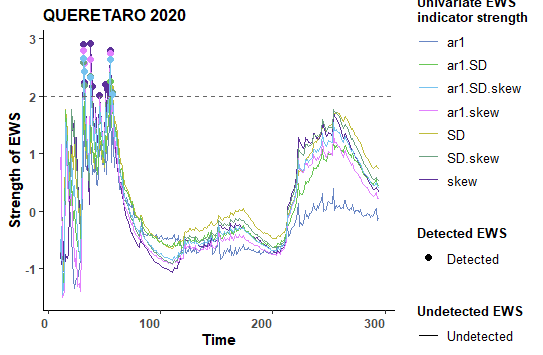
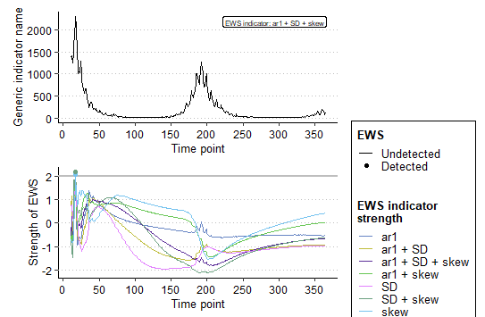

```{r setup, include=FALSE}
library(tidyr)
library(tidyverse)
library(EWSmethods)
library(ggplot2)
library(owidR)
library(dplyr)
```

## **Observaciones graficas Queretaro.**

**2020**

{width="422"}](images/clipboard-350689426.png){width="418"}

**2021**

{width="421"}

{width="428"}

La curva de las metricas decae.

**2022**

{width="416"}

{width="415"}

**2023**

{width="418"}

{width="419"}

Decaen los casos, no tan marcada la caida de los casos, pero significativa.

**2024-5**

{width="418"}

{width="424"}

## OBSERVACIONES VERACRUZ.

**2020**

{width="422"}

{width="428"}

Grafica de 2023, en esta no se observa ninguna señal EWS; los picos que decresen no son tan "drasticos" a comparacion con los picos que decresen de otros estados.
